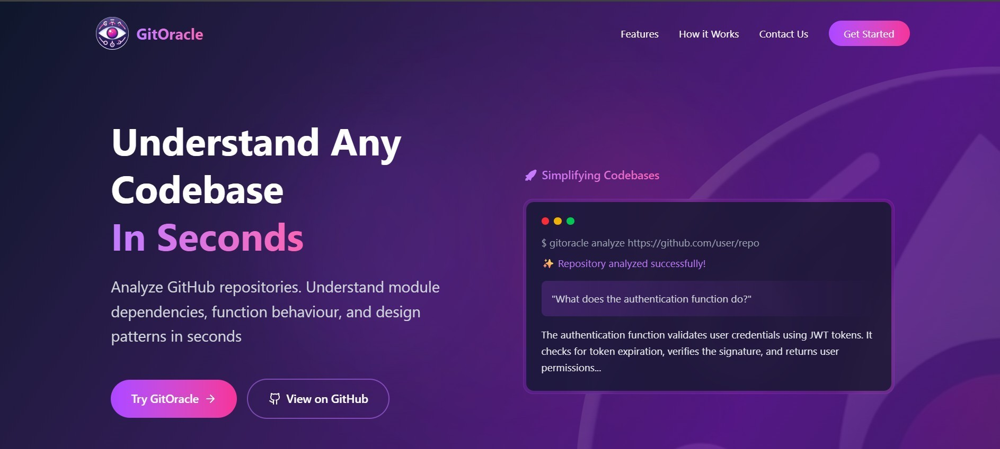
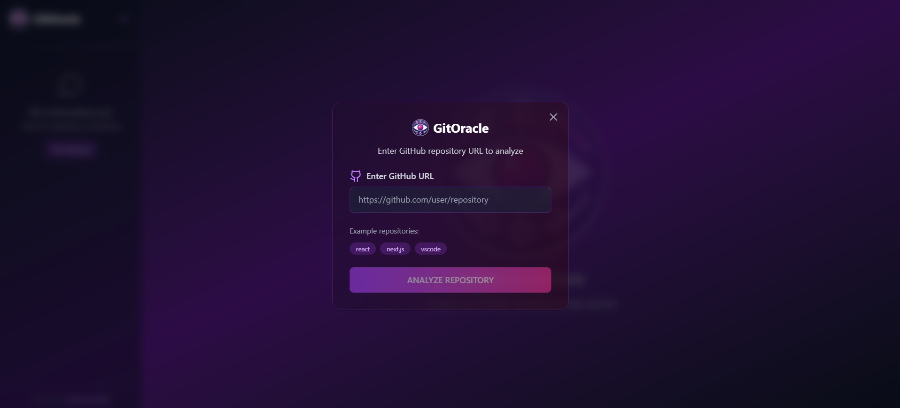
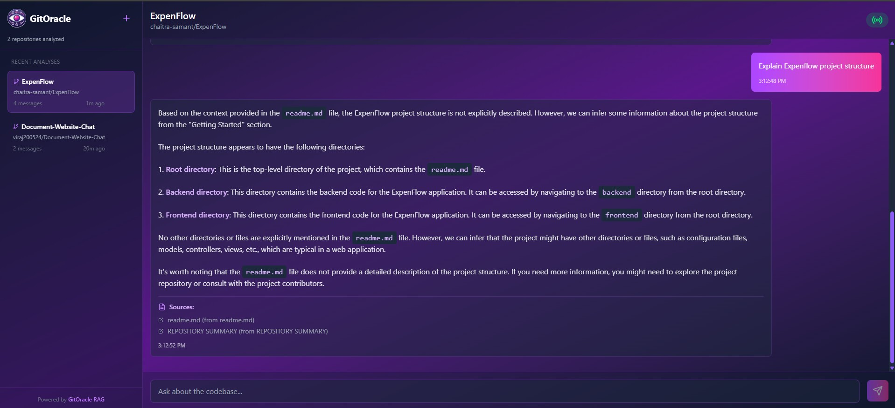
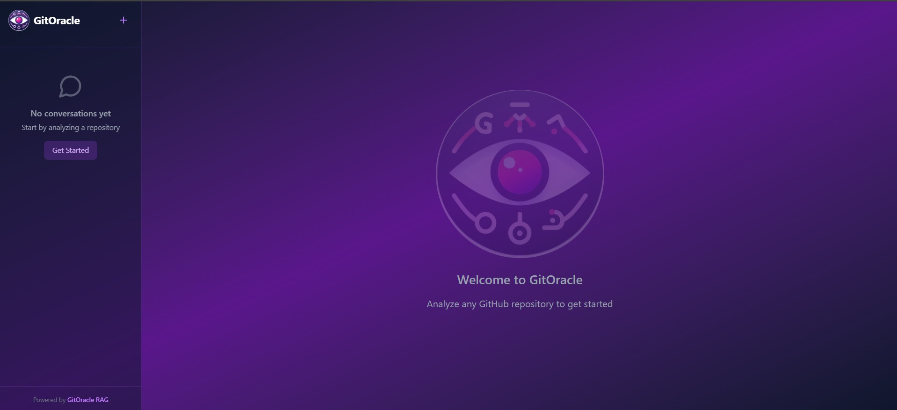

<p align="center">
  
</p>

<h1 align="center">GitOracle</h1>
A powerful Retrieval-Augmented Generation (RAG) system that helps you understand complex repositories using natural language. Built with FastAPI backend and modern React frontend powered by Vite.

### 🎥 [Watch Demo Video here](https://www.youtube.com/watch?v=jjXitxTumT8)

### 📸 Screenshots

<p align="center">
  
  
  
  
</p>


## 🌟 Features

- **Repository Ingestion**: Clone and process any public GitHub repository
- **Intelligent Chunking**: Automatically splits code files into meaningful chunks
- **Vector Search**: Uses embeddings to find relevant code snippets
- **Natural Language Queries**: Ask questions about repositories in plain English 
- **Modern React UI**: Fast and responsive interface built with Vite
- **Real-time Processing**: Live feedback during repository ingestion

## 📁 Project Structure

```
├── backend/
│   ├── ingest.py          # Repository content extraction
│   ├── rag.py             # RAG implementation
│   ├── main.py            # FastAPI backend server
│   ├── app.py             # Streamlit Testing UI
│   └── processed_files.json # Cached files for faster lookup
│
├── frontend/
│   ├── public/            
│   ├── src/
│   │   ├── assets/        # Project assets
│   │   ├── components/    # React components
│   │   ├── App.css        # Main styles
│   │   ├── App.jsx        # Main React component
│   │   ├── index.css      # Global styles
│   │   └── main.jsx       # React entry point
│   ├── .gitignore
│   ├── eslint.config.js
│   ├── index.html         # HTML template
│   ├── package.json       # Node.js dependencies
│   ├── package-lock.json
│   └── vite.config.js     # Vite configuration
│
├── .gitignore
└── README.md
```

## 🚀 Quick Start

### 1. Clone the Repository

```bash
git clone https://github.com/chaitra-samant/GitOracle
cd GitOracle
```

### 2. Backend Setup

```bash
# Navigate to backend directory
cd backend

# Create virtual environment
python -m venv myenv
myenv/Scripts/activate  

# Install Python dependencies
pip install -r requirements.txt
```

### 3. Frontend Setup

```bash
# Navigate to frontend directory
cd ../frontend

# Install Node.js dependencies
npm install
```

### 4. Environment Setup

Create a `.env` file in the backend directory:

```env
# GROQ API 
GROQ_API_KEY=your_groq_api_key_here

# API Configuration
API_BASE_URL=http://localhost:8000
```

### 5. Run the Application

#### Start FastAPI Backend
```bash
# Terminal 1 - from backend directory
cd backend
uvicorn main:app --reload --host 0.0.0.0 --port 8000
```

#### Start Vite Frontend
```bash
# Terminal 2 - from frontend directory
cd frontend
npm run dev
```

### 6. Access the Application

- **React Frontend**: http://localhost:5173 
- **FastAPI Backend**: http://localhost:8000
- **API Documentation**: http://localhost:8000/docs

## 📋 Using the Application

### Ingesting a Repository

1. Open the React interface at http://localhost:5173
2. Enter a GitHub repository URL (e.g., `https://github.com/username/repo`)
3. Click "🚀 Ingest Repository"
4. Wait for processing to complete with real-time progress updates

### Querying the Repository

1. After successful ingestion, use the query interface
2. Ask questions like:
   - "What does this repository do?"
   - "How do I use the main function?"
   - "What are the key components?"
   - "Show me the database models"
   - "Explain the API endpoints"


## 🔧 Configuration

### Supported File Types

The system processes these file types by default:
- `.py` (Python)
- `.js`, `.jsx` (JavaScript)
- `.ts`, `.tsx` (TypeScript)
- `.java` (Java)
- `.cpp`, `.c`, `.h` (C/C++)
- `.cs` (C#)
- `.go` (Go)
- `.rs` (Rust)
- `.md` (Markdown)
- `.txt` (Text)
- `.yml`, `.yaml` (YAML)
- `.json` (JSON)


## 🤝 Contributing

1. Fork the repository
2. Create a feature branch (`git checkout -b feature/new-feature`)
3. Make your changes:
   - Backend changes in `backend/`
   - Frontend changes in `frontend/src/`
4. Test your changes:
   - Backend: Run FastAPI server and test endpoints
   - Frontend: Run `npm run dev` and test UI
5. Commit your changes (`git commit -m 'Add new feature'`)
6. Push to the branch (`git push origin feature/amazing-feature`)
7. Open a Pull Request

